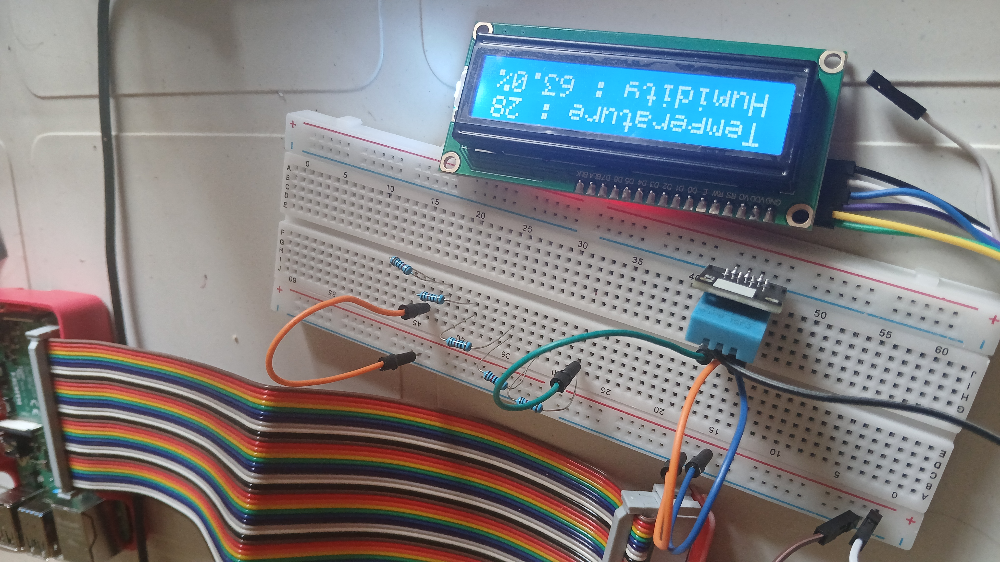

# Temp_LCD_Webserver

A simple application for measuring temperature and humidity using the DHT11 sensor. The captured values are displayed on an LCD screen. Additionally, these values can be viewed on a webpage via a built-in Flask web server.

## Features
- Measure temperature and humidity using the DHT11 sensor.
- Display the captured data on an LCD screen.
- Serve the data on a web page using a Flask web server.

## Setup and Requirements
1. **Hardware:**
   - Raspberry Pi
   - DHT11 Sensor
   - LCD Display

2. **Software:**
   - Flask (for the web server)
   - WiringPi (for controlling the LCD and sensor)

## How to Run
1. Connect the DHT11 sensor and LCD to your Raspberry Pi.
2. Install the necessary dependencies:
   ```bash
   sudo apt-get install wiringpi
   pip install flask
3. Run the Python script to start the server:

python3 dht11.py

Access the webpage by visiting http://<raspberry_pi_ip>:8080 in your browser.

### Image of the Setup

